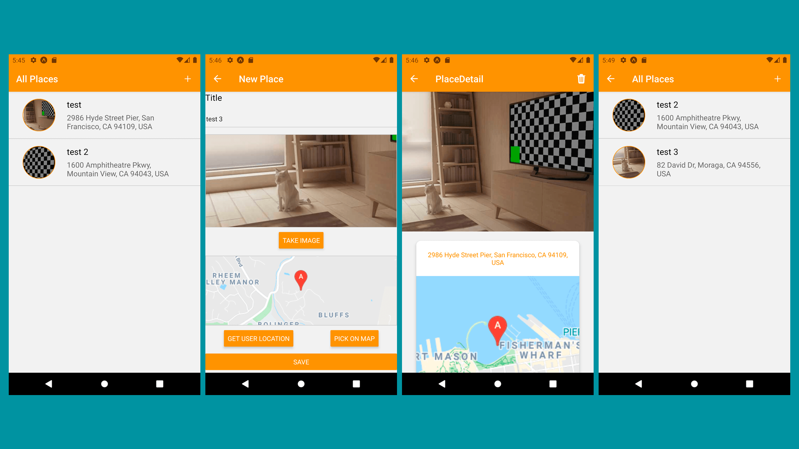

This project was bootstrapped with [Create React Native App](https://github.com/react-community/create-react-native-app).
# react-native-Great-places-app

## Great Placess app

### Native features
- Camera
- Maps
- Location
- SQLite
    - store
    - fetch
    - add
    - delete
### Navigation
- React Navigation 5+
- StackNavigator
### Redux
- Data and navigation
- Dispatching actions

